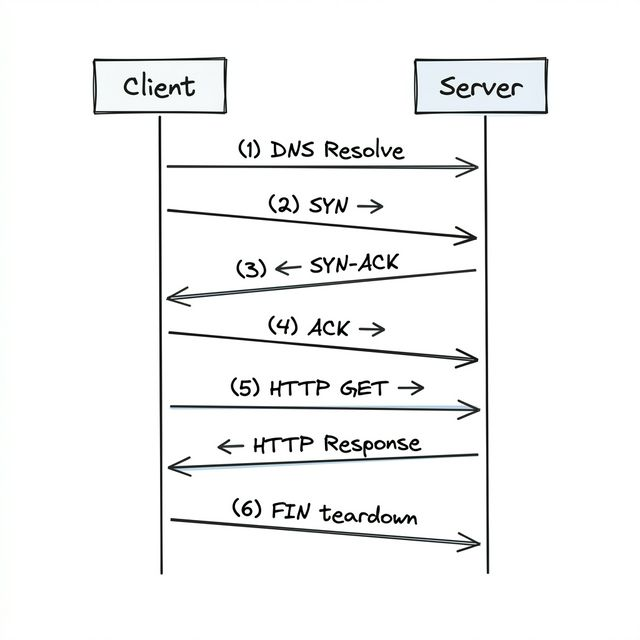

# Chapter 1 The Three Layers You Need to Know

## Layer 3: The Network Layer — "Where does this go?"

This is the addressing layer, run by a protocol called IP (Internet Protocol).

IP's job is to look at the destination address and figure out how to route your data across the internet, hopping from router to router until it reaches the right machine. This journey introduces latency. `latency: The time it takes for data to travel from source to destination. Lower is better.`

## Layer 4: The Transport Layer — "Did it arrive safely?"

Packets can get lost, duplicated, or arrive in the wrong order. The transport layer sits above IP and handles how the data should be delivered.

The two main protocols here are:

- **TCP** — Reliable delivery. "I'll make sure every piece of data arrives, in order, no matter what." This is what most of the internet uses.

- **UDP** — Fast but unreliable. "I'll send it as fast as possible, but if something gets lost... oh well." Used for things like video calls and gaming.

## Layer 7: The Application Layer — "What does the data mean?"

serves as the direct interface between end-user software applications (browsers, email clients) and the network

These protocols decide how your data is formatted and what it means.

## How They Work Together

Here's the cool part. When you send an HTTP request, each layer wraps it up :

1. Your app creates an HTTP request ("GET /users/42")
2. Layer 4 (TCP) wraps that in a segment, adding port numbers and tracking info
3. Layer 3 (IP) wraps that in a packet, adding the source and destination addresses

When it arrives at the other end, the process reverses. Layer 3 opens its envelope, passes the contents to Layer 4. Layer 4 opens its envelope, passes the contents to the app. By the time your code sees the data, all the networking wrapping has been peeled away.

---

# Chapter 2 Life of a Web Request

## You Type a URL. Then What?

You type `www.example.com` into your browser and press enter. A page appears. Feels instant, right?



### Step 1: Finding the Address (DNS)

Your browser doesn't know where `www.example.com` lives. It needs a an IP address like `93.184.216.34`.

So it asks a DNS server. DNS is basically the phone book of the internet. You give it a name ("example.com"), it gives you back a number ("93.184.216.34").

Your browser actually checks several places before asking a DNS server:

- Its own cache ("did I look this up recently?")
- Your operating system's cache
- Your router's cache
- Your ISP's DNS server

Only if nobody has the answer does the request travel further up the chain. Once found, the result gets cached so next time it's instant.

### Step 2: Establishing a Connection (TCP Handshake)

Now your browser knows the IP address. But before it can send anything, it needs to set up a reliable connection.

This happens through a three-way handshake:

1. Your browser says "Hey, can we talk?" (sends a SYN packet)
2. The server says "Sure, I'm ready" (sends back a SYN-ACK packet)
3. Your browser says "Great, let's go" (sends an ACK packet)

That's three messages back and forth before a single byte of your actual request has been sent. If the server is on another continent, each of those messages takes time

### Step 3: Asking for the Page (HTTP Request)

With the connection established, your browser finally sends the actual request:

    GET /index.html HTTP/1.1
    Host: www.example.com

### Step 4: The Server Does Its Thing

The server receives the request and does whatever work it needs to

### Step 5: Getting the Response

The server sends back the page content along with a status code .

### Step 6: Hanging Up (TCP Teardown)

Once everything's been received, the connection gets closed through a `four-way handshake`

1. Client: "I'm done sending" (FIN)
2. Server: "Got it" (ACK)
3. Server: "I'm done too" (FIN)
4. Client: "Got it, bye" (ACK)

---

# Chapter 3 UDP

## What You Get With UDP

When a UDP message (called a `datagram`) arrives at your application, here's everything you know:

- Who sent it (source IP address and port)
- Who it was meant for (destination IP address and port)
- The data itself (a blob of bytes)

That's it. That's the whole protocol.

## What UDP Deliberately Skips

UDP doesn't do any of the safety stuff that TCP does. And that's on purpose.

| Feature                      | Does UDP do it?                    |
| ---------------------------- | ---------------------------------- |
| Connection setup (handshake) | Nope — just send it                |
| Guaranteed delivery          | Nope — packets can vanish          |
| Ordering                     | Nope — packets can arrive shuffled |
| Flow control                 | Nope                               |
| Congestion control           | Nope                               |
| Header size                  | Tiny — just 8 bytes                |

**"Wait, packets can just disappear and nobody tells you?" Yep. "And they can arrive in random order?" Yep.**

**Sounds terrible. So why would anyone use this?**

## When "Unreliable" Is Actually What You Want

Let's think about a phone call (like a Zoom call).

You're talking to someone. One tiny audio packet — maybe 20 milliseconds of sound — gets lost somewhere in the network. What should happen?

**Option A**: Pause the whole call. Request the missing packet. Wait for it. Then play it. Your friend hears a long awkward silence followed by a word from 2 seconds ago. Terrible.

**Option B**: Skip it. Your friend hears a tiny blip — barely noticeable — and the conversation flows naturally.

Option B is clearly better. And that's exactly what UDP enables. The lost packet is already outdated by the time you could retransmit it. Better to move on.

Where UDP Shines

- `Video and audio streaming` — A dropped frame is invisible. A frozen stream is infuriating.
- `Online gaming` — Player positions update dozens of times per - second. Missing one is nothing.
- `Voice calls (VoIP)` — Same logic as the phone call example above.
- `DNS lookups` — Tiny, fast queries. If one gets lost, just send another. Takes milliseconds.
- `High-volume logging/metrics` — If you're sending thousands of log entries per second and a few get lost, that's usually fine.

## One Gotcha: Browsers Can't Do Raw UDP

Web browsers don't support sending raw UDP messages. The one exception is `WebRTC`, and that's specifically for audio/video calls.

---

# Chapter 4 TCP

TCP is the opposite. It's like a proper phone call:

1. You dial (connection setup)
2. They pick up (connection established)
3. You have a conversation where both sides hear everything, **in order**
4. You say goodbye and hang up (connection teardown)

TCP (Transmission Control Protocol) is the workhorse behind almost everything on the internet. Every time you load a webpage, send an email, query a database, or call a REST API — TCP is underneath, making sure every byte arrives correctly.

## The Connection: A Stream You Can Trust

We already saw the `three-way handshake (SYN → SYN-ACK → ACK)`. Once that handshake completes, you have a stream — a reliable, ordered channel between two machines.

Think of it like a pipe. You pour data in one end, and it comes out the other end in the exact same order. If some data gets stuck in the pipe (a packet gets lost), TCP notices and pushes it through again until it arrives.

| Feature            | How It Works                                                                                                                 |
| ------------------ | ---------------------------------------------------------------------------------------------------------------------------- |
| Reliable delivery  | Every packet gets acknowledged. If the acknowledgment doesn't come back, TCP resends the packet automatically.               |
| Ordering           | Even if packets arrive shuffled (because they took different routes), TCP reassembles them in the exact order you sent them. |
| Flow control       | The receiver says "I can handle X amount of data right now." The sender adjusts. Nobody gets overwhelmed.                    |
| Congestion control | If the network itself is busy, TCP slows down to avoid making traffic jams worse.                                            |

### Flow Control — "Don't Talk Faster Than I Can Listen"

Imagine you're dictating a letter and the person writing it down can only write so fast. If you talk too quickly, they'll miss words.

TCP handles this with a sliding window. The receiver tells the sender: "I have room for 1000 bytes in my buffer." The sender sends up to 1000 bytes, then waits for the receiver to say "okay, I've processed some, you can send more." Nobody's buffer overflows.

### Congestion Control — "Don't Clog the Network"

Flow control prevents overwhelming the receiver. Congestion control prevents overwhelming the network.

TCP starts slow — sending just a little data. If everything's getting through fine, it gradually speeds up. The moment it detects a lost packet (a sign the network is congested), it backs off. Then slowly ramps up again.

This is why a brand new TCP connection starts slow and takes a moment to reach full speed. For long downloads, that doesn't matter. For short requests (like a quick API call), you might never reach full speed before the request is done. That's one of the costs of TCP's cautious approach.

Congestion Control — "Don't Clog the Network"
Flow control prevents overwhelming the receiver. Congestion control prevents overwhelming the network.

TCP starts slow — sending just a little data. If everything's getting through fine, it gradually speeds up. The moment it detects a lost packet (a sign the network is congested), it backs off. Then slowly ramps up again.

This is why a brand new TCP connection starts slow and takes a moment to reach full speed. For long downloads, that doesn't matter. For short requests (like a quick API call), you might never reach full speed before the request is done. That's one of the costs of TCP's cautious approach.

### The Cost of Safety

All these guarantees aren't free. Here's what you pay for TCP's reliability:

Connection setup takes time. The three-way handshake adds a full round trip before any data flows. If the server is across the ocean, that's 50-100ms just for the handshake. Before your actual data even starts moving.

Extra traffic. Every packet needs an acknowledgment. That's more packets on the wire.

Head-of-line blocking. This one's tricky. Imagine TCP is delivering 10 packets. Packet #3 gets lost. Packets #4 through #10 arrive fine — but TCP won't pass them to your application until #3 has been retransmitted and received. Everything waits in line behind the missing packet. This is TCP's biggest pain point for applications that send multiple independent streams of data over one connection.

Bigger headers. TCP headers are 20-60 bytes vs UDP's 8 bytes. For tiny, frequent messages, that overhead adds up.

# Cahpter 5 TCP vs UDP — How to Pick

## The Decision Flowchart Is Short

**Question 1**: Does your data need to arrive completely and in order?

- Yes → TCP
- No → Maybe UDP. Keep reading.

**Question 2**: Is latency more important than completeness? Would you rather skip missing data than wait for it?

- Yes → UDP is worth considering
- No → TCP

**Question 3**: Are you building for web browsers?

- Yes, and not doing video calls → TCP (browsers can't do raw UDP)
- No, or you're doing video → UDP might work


<br/>

| UDP                                                | TCP                                         |
| -------------------------------------------------- | ------------------------------------------- |
| Connection: None. Just send data.                  | Must set up a connection first (handshake). |
| Reliability: Packets can vanish. Nobody tells you. | Every packet is guaranteed to arrive.       |
| Ordering: Packets can arrive in any order.         | Packets are always delivered in order.      |
| Speed: Faster. Less overhead.                      | Slower. Handshakes + acknowledgments.       |
| Header size: 8 bytes                               | 20–60 bytes                                 |
| Analogy: Walkie-talkie. Shout and hope.            | Phone call. Set up, talk, hang up.          |
| Good for: Streaming, gaming, VoIP                  | Everything else                             |

## When to Reach for UDP

- **DNS** — Tiny queries, tiny responses. If a DNS lookup packet gets lost, the client just sends another one. Faster than setting up a TCP connection for a 50-byte question.

- **Real-time audio/video**

- **Online gaming**

- **High-volume telemetry**

## When to Stick With TCP

Everything else. Seriously.

- Loading a webpage → TCP
- Calling a REST API → TCP
- Querying a database → TCP
- Sending an email → TCP
- Uploading a file → TCP
  Processing a payment → Definitely TCP (you don't want payment - data getting lost!)

<b>Your team is building a file upload API. A user uploads a 500MB video file. Which protocol is the right choice?

TCP — you can't afford to lose even a single byte of the file</b>

---

# Chapter 6 HTTP & HTTPS

HTTP is `stateless`:

`Idempotent`: An operation that produces the same result whether you run it once or multiple times.

POST is NOT idempotent while GET, PUT , DELETE idempotent.

## Status Codes — "What Happened?"

When the server responds, it includes a number that tells you what happened. You don't need to memorize them all, but these come up constantly:

_It worked (2xx):_

- 200 OK — Here's what you asked for
- 201 Created — Done, I made the new thing

**It moved (3xx):**

- 301 Moved Permanently — This page lives somewhere else now. Update your bookmarks.
- 302 Found — This page is temporarily somewhere else.

**You messed up (4xx):**

- 400 Bad Request — I don't understand what you're asking
- 401 Unauthorized — Who are you? Log in first.
- 403 Forbidden — I know who you are, but you're not allowed
- 404 Not Found — That thing doesn't exist
- 429 Too Many Requests — Slow down, you're sending too many requests

**The server messed up (5xx):**

- 500 Internal Server Error — Something broke on the server
- 502 Bad Gateway — The server tried to talk to another server and got garbage back

## HTTPS — "HTTP But Private"

HTTPS is just HTTP with encryption wrapped around it (using something called TLS/SSL). Everything works the same way — same methods, same status codes, same headers. But the contents of your request and response are encrypted in transit.

What HTTPS protects against:

- **Eavesdropping** — Nobody between you and the server can read your data (not your ISP, not the coffee shop WiFi, nobody)
- **Tampering** — Nobody can secretly modify the data while it's moving between you and the server
  If you're building anything public-facing, you're using HTTPS. There's no good reason not to.

## A Common Security Mistake

Here's something worth knowing: HTTPS encrypts data in transit, but it doesn't validate the contents of a request on the server.

Let's say your API accepts a request like GET /api/users/42 and returns that user's data. What if someone changes it to GET /api/users/99? If your server doesn't check whether the logged-in user is allowed to see user 99's data, you have a security hole. HTTPS won't save you — it just ensures nobody can intercept the request, not that the request itself is legitimate.

The rule: your API should never trust request data without validating it. HTTPS protects the pipe, not the contents.

## HTTP Versions (Quick Context)

HTTP has evolved over the years:

- HTTP/1.1 — One request per connection (or you can reuse the connection with keep-alive). Simple, universally supported.
- HTTP/2 — Multiple requests can share one connection at the same time (called `multiplexing`). Much faster for loading web pages with lots of resources.
- HTTP/3 — Runs on QUIC (a protocol built on UDP) instead of TCP. Fixes a nasty problem HTTP/2 still had: if one packet is lost, TCP freezes all streams on the connection while it waits for retransmission. HTTP/3 handles each stream independently, so a dropped packet only stalls the stream it belongs to. Increasingly common — YouTube, Google, and Cloudflare all use it.

> 💡 A common interview question is "does HTTP/2 multiplexing replace WebSockets?" The answer is no — HTTP/2 is still request-response (the server can't spontaneously push messages to the client). WebSockets provide true full-duplex communication.

---

# Chapter 7 REST — Thinking in Resources

## Why REST Works So Well

**It's simple**. You already know HTTP methods from the last lesson. REST just gives you conventions for how to use them with URLs.

**It's cacheable**. GET requests can be cached by browsers, CDNs, and proxies out of the box. If you ask for /users/42 twice, the second time might come from a cache instead of hitting your server.

**Everyone understands** it. If you say "I'm building a REST API," every developer on your team knows what to expect. Most major public APIs (Stripe, GitHub, Twilio) are RESTful.

It maps to **your data model**. If you've already identified the core entities in your system (Users, Orders, Products), they map directly to REST resources. No extra translation needed.

## Where REST Gets Awkward

**Under-fetching**: Your mobile app needs to display a profile page showing a user, their posts, and their groups. With REST, that's three separate requests: GET /users/42, GET /users/42/posts, GET /users/42/groups. Three round trips. On a slow mobile connection, that adds up.

**Over-fetching**: Your GET /users/42 endpoint returns everything about the user — name, email, avatar, settings, payment info, preferences — even though you only needed the name and avatar. Wasteful.

These problems are what GraphQL was designed to solve. We'll look at that next.

---

# Chapter 8 GraphQL & gRPC

**The frontend keeps needing different slices of data → GraphQL**

**Backend services need to talk to each other really fast → gRPC**

## GraphQL: "Just Give Me What I Need"

Imagine you're building a mobile app. The profile screen needs to show a user's name, their 5 most recent posts, and the groups they belong to.

**REST** -> you need multiple round trips to get everything for one screen. On a slow mobile connection, each round trip hurts.

**graphQL** -> nstead of the server deciding what data to return, the client specifies exactly what it needs:

```graphql
query {
  user(id: 42) {
    name
    avatar
    posts(limit: 5) {
      title
      createdAt
    }
    groups {
      name
    }
  }
}
```

Only the fields you asked for. The server returns data shaped exactly like your query. No wasted data, no extra round trips.

### When It's Overkill

For most system design discussions, GraphQL adds complexity without clear benefit. You have a fixed set of requirements (not a moving target), and the interviewer usually wants to see how you optimize specific queries — GraphQL can get in the way of that conversation.

Use GraphQL in a design when the problem is explicitly about data flexibility or multiple client types needing different data shapes. Otherwise, REST is simpler and sufficient.

## Advanced Deep Dive: The N+1 Query Problem (Can skip)

GraphQL fixes over-fetching on the frontend, but it can create a severe problem on the backend: the `N+1 query trap`. Consider our profile query — it fetches a user and their 5 posts. The GraphQL resolver for `user` hits the database once (1 query). Then the resolver for `posts` runs per user — if you're fetching a list of 50 users, that's 1 query for the user list + 50 individual queries for each user's posts = `51 database queries` for one API call.

At scale, this destroys database performance. The standard fix is a tool called `DataLoader` (created by Facebook alongside GraphQL). DataLoader batches those 50 individual `getPostsByUserId` calls into a single `SELECT * FROM posts WHERE user_id IN (...)` query. Without it, a deeply nested GraphQL query can silently generate hundreds of database round trips.

## gRPC: "Talk Fast, Talk Small"

JSON has two downsides:

It's `verbose` — field names are repeated in every message
It's `slow to parse` — text parsing is CPU-intensive compared to binary

**How gRPC Fixes This**
gRPC (created by Google) replaces JSON with `Protocol Buffers` — a compact binary format. You define your data structure once in a .proto file:

```protobuf
message User {
  string id = 1;
  string name = 2;
}
```

The same user in JSON:

```JSON
{"id": "123", "name": "John Doe"}
```

JSON → about 40 bytes

Protocol Buffers:
→ about 15 bytes

Less data, and the binary format is much faster for computers to read and write.

#### When gRPC Makes Sense

- **Internal service-to-service communication** where performance matters
  **High-throughput systems** processing millions of requests per second
  When strong **type safety** between services is valuable (errors caught at compile time, not runtime)

#### When It Doesn't

web browsers can't natively speak it, and it's harder to debug

**REST for external APIs, gRPC for internal communication**

> 💡 Interview Tip
> Saying "REST for external, gRPC for internal" is a clean, defensible default. If asked to justify it: "REST is universally understood and easy for external consumers. gRPC gives us type safety and binary encoding for high-throughput internal calls." Simple.

---

# Chapter 9 Server-Sent Events — Push Without the Complexity

## The "Are We There Yet?" Problem

- Imagine you're tracking a pizza delivery. You could call the restaurant every 30 seconds and ask "is it here yet?" That's **polling** — and it's wasteful. Most of the time, the answer is "no," and you just wasted a phone call.

- Wouldn't it be better if the restaurant just called you when something changed? "Your pizza is in the oven." "Your driver just left." "They're at your door."

- That's exactly what **Server-Sent Events (SSE)** does. Instead of the client constantly asking "anything new?", the server keeps a line open and pushes updates whenever it has something to say.


## How It Works — It's Just HTTP, But Clever

With SSE, the server sends a response that never finishes. It keeps the connection open and trickles in small messages over time

    data: {"id": 1, "description": "Order placed"}

    data: {"id": 2, "description": "Pizza in the oven"}

    data: {"id": 3, "description": "Driver on the way"}

Each line arrives as a separate event. The client processes each one the moment it lands. It's technically still one HTTP response — it just keeps going.

## Connections Don't Last Forever

Servers, load balancers, and proxies will eventually close long-lived connections. But SSE handles this gracefully — the EventSource in the browser automatically reconnects when the connection drops, and it tells the server "the last message I got was #7." The server can then resend anything missed.

This means your server needs to keep track of recent messages — a small price to pay for reliability.

## Sneaky Network Middleboxes

Some corporate proxies and mobile carriers will batch up SSE responses and deliver them all at once. Instead of getting real-time updates

Think of it like a postal worker who holds all your letters and delivers them once a week. Technically delivered, but not exactly `real-time`.

    Advanced Deep Dive: Why SSE Breaks Behind Corporate Firewalls

    This middlebox problem is more common than you'd think. Many L7 proxies and reverse proxies (Nginx, AWS ALB, corporate firewalls) buffer HTTP response bodies by default — they wait for the full response before forwarding. Since an SSE response never finishes, the proxy just holds it indefinitely until a timeout fires, then dumps everything at once.

    The mitigations:

    - "Use HTTP/2" — HTTP/2's multiplexing and framing means proxies pass data through stream-by-stream rather than buffering the entire response. Most SSE proxy issues disappear on HTTP/2.

    -  "Set X-Accel-Buffering": no — This header tells Nginx to disable response buffering for this endpoint.

    - "Set Cache-Control": no-cache — Signals to intermediate proxies not to cache or buffer the response.

    - "Fallback to long-polling" — If SSE doesn't work in a given environment, fall back to polling. Libraries like EventSource polyfills handle this automatically.

    If an interviewer asks about SSE downsides, mentioning proxy buffering is a real-world gotcha that demonstrates production experience.

## One-Way Street Only

SSE is server → client only. If the client needs to send data back, it uses separate HTTP requests. For many use cases (notifications, live feeds, price updates), this is totally fine. The client can always fire off a regular POST request when it needs to say something.

## Where SSE Shines

SSE is perfect when the server has updates and the client just needs to listen:

**Auction price updates** — Bidders see the current price change in real-time

**Live sports scores** — Scores push to clients as they happen

**Notification feeds** — New notifications appear without refreshing the page

**Progress tracking** — "Your file is 40% uploaded... 60%... 80%... done!"

**Stock tickers** — Prices stream to your dashboard continuously

If your data changes every few minutes and a small delay is fine, polling works great. If users expect instant updates, SSE is the way to go.

If you need bidirectional real-time communication. That's where WebSockets come in.

**Many people jump straight to WebSockets when the problem only needs server-to-client updates. "we don't need WebSockets here, SSE is enough because the client doesn't need to send real-time data back."**

---

# Chapter 10 WebSockets

## How the Connection Gets Started

Here's the clever part about WebSockets — they start as regular HTTP and then upgrade:

- **Client sends a normal HTTP request with an Upgrade**: websocket header — "Hey, can we switch to WebSockets?"
- **Server agrees** — "Sure, let's upgrade"
- **The connection transforms** — Same TCP connection, but now it speaks WebSocket instead of HTTP
- **Both sides talk freely** — Either side can send a message at any time
- **Connection stays open** — Until someone explicitly closes it

**Every Connection Eats Memory** :
With regular HTTP, a server handles a request and immediately forgets the client. With WebSockets, the server has to remember every connected client.

**Load Balancing Gets Messy**
With stateless HTTP, any server can handle any request — that's easy to load balance. But with WebSockets, each client is connected to one specific server. You can't just move them mid-conversation.

**Not Everything in the Network Plays Nice**: Firewalls, proxies, and corporate networks don't always understand WebSocket connections. You might find WebSockets working perfectly in development but failing for some users in production

## "Doesn't HTTP/2 Make WebSockets Redundant?"

HTTP/2 introduced multiplexing — multiple requests can share one TCP connection simultaneously. That sounds like it solves the same problem as WebSockets. But there's a fundamental difference:

- **HTTP/2 is still request-response**. The client sends a request, the server sends a response. The server cannot spontaneously push a message to the client without the client asking first.

**"does the client actually need to push real-time data back?" If the answer is no, say "SSE is enough here"**

---

# Cahpter 11 WebRTC

Everything we've talked about so far follows a client-server pattern. Your browser talks to a server, the server talks back. WebRTC breaks that pattern entirely.

WebRTC (Web Real-Time Communication) lets Person A and Person B talk directly to each other. No interpreter needed.

## The "I Can't Find Your House" Problem

Here's why peer-to-peer is harder than it sounds. Most devices on the internet hide behind a NATNAT: Network Address Translation — lets multiple devices share a single public IP address. (Network Address Translation) — that's your home router, your office firewall, your mobile carrier's network.

Think of NAT like living in an apartment building. The building has one address that the outside world can see, but your apartment number is only known internally. If someone on the street wants to reach you directly, they know the building but not which apartment you're in. And the building's security (the firewall) might not let them in at all.

Both people on a video call are usually behind NATs. Neither can directly reach the other. So WebRTC needs some clever tricks to make the connection work.

## How WebRTC Actually Connects Two People

Setting up a WebRTC connection is like two people trying to meet in a city where neither knows the other's address. They need helpers.


### Step 1: The Matchmaker (Signaling Server)

Both people connect to a signaling server — think of it as a mutual friend who can relay messages. This server doesn't carry any audio or video. It's just there to help the two sides exchange contact information.

"Hey, Alice wants to call Bob. Bob, here's how to reach Alice. Alice, here's how to reach Bob."

The signaling server can use any protocol — usually WebSockets or plain HTTP. WebRTC doesn't define how signaling works; it's up to you.

### Step 2: Figuring Out Your Own Address (STUN)

Each person asks a STUN server (Session Traversal Utilities for NAT): "What does my address look like from the outside?" It's like stepping outside your apartment building and checking the building number.

STUN also uses a technique called "hole punching" to poke an opening through the NAT so the other person can reach you. Yes, it sounds hacky. It is. But it's standardized and it works most of the time.

### Step 3: Exchanging Addresses

Through the signaling server, both sides share the addresses they discovered. Now each person knows how to find the other.

### Step 4: Direct Connection!

The two browsers establish a direct connection and start streaming audio/video over UDP

### The Backup Plan: TURN

Sometimes STUN isn't enough. Some corporate firewalls block everything, some NATs are too strict. When the direct connection fails, there's TURN (Traversal Using Relays around NAT) — a relay server that bounces traffic between the two people.

TURN defeats the purpose of peer-to-peer (data goes through a server again), but it's the fallback when nothing else works. Think of it as the mutual friend saying "You two can't meet directly? Fine, tell me what to say and I'll relay everything." In practice, a significant chunk of WebRTC connections end up needing TURN.

---

# Cahpter 12 Load Balancer

## Two Ways to Balance the Load

There are two fundamentally different approaches, and each has its place:

1. **Client-Side Load Balancing — "The Client Picks"**: The client itself decides which server to talk to. It gets a list of available servers from a directory (called a service registry) and picks one. No middleman needed.

2. **Dedicated Load Balancer — "A Traffic Cop"**:A separate component sits between clients and servers, routing every request. The client talks to the load balancer, the load balancer talks to a server.

| Component     | Core Job                                                        | Example                                                                   |
| ------------- | --------------------------------------------------------------- | ------------------------------------------------------------------------- |
| Load Balancer | Distribute traffic across multiple servers                      | Nginx, AWS Application Load Balancer / AWS Network Load Balancer, HAProxy |
| Reverse Proxy | Sit in front of servers, hide internal topology from clients    | Nginx, Envoy, Caddy                                                       |
| API Gateway   | Auth, rate limiting, request transformation, billing, analytics | Kong, AWS API Gateway, Apigee                                             |

**A reverse proxy is the broadest concept — any server that sits between clients and your backend, forwarding requests on the client's behalf. Clients talk to the proxy; the proxy talks to your servers. This hides your internal network structure.**

**A load balancer is a reverse proxy that distributes traffic. All load balancers are reverse proxies, but not all reverse proxies load balance.**

**An API gateway is a reverse proxy that does application-level work — authenticating requests, enforcing rate limits, transforming payloads, routing by API version, collecting billing metrics. I**

### The two main reasons are why load balancer.

1. **distributing traffic** so no single server is overwhelmed, and
2. **automatic failover** — if a server goes down, the load balancer routes around it.

## Client-Side Load Balancing

### Example You Already Know: DNS (IMP)

Here's the thing — you're already using client-side load balancing every time you open a website.

When your browser looks up `api.example.com`, the DNS server returns a list (**servers hosting the same website**) of IP addresses in a rotated order. Each person who looks it up gets a slightly different ordering, so traffic naturally spreads across servers.

It's like a phone directory that lists the same business at multiple locations — and shuffles the order each time you look it up, so different people call different branches.

### The DNS Catch: Slow Updates

DNS entries have a TTL (Time To Live)— how long the address can be cached before checking again. If the TTL is 5 minutes and a server goes down, it could take up to 5 minutes before clients stop trying to reach it.

## When Client-Side Load Balancing Works

1. **A small number of clients you control**

2. **Lots of clients where slow updates are acceptable**

## When It Doesn't Work

1. **You don't control the clients**
2. **You need instant failover**
3. **you need smart routing**

## L4 vs L7 Load Balancers

### Two Flavors of Load Balancer

When you put a dedicated load balancer between clients and servers, it needs to decide where to send each request. How it makes that decision depends on how deeply it inspects the traffic — and that gives us two very different types.

### Layer 4: The Speed Demon

An L4 load balancer works at the transport layer (TCP/UDP). It looks at the outside of the envelope — IP addresses and port numbers — and routes based on that. It never opens the envelope to read what's inside.

#### What makes L4 special:


- **Pass-through connections** — The client's TCP connection goes all the way to the backend server. The LB just forwards packets along. It's like the toll booth opened a direct lane for you.
- **Very fast** — Since it's not reading contents, there's minimal overhead
- **Can't make smart decisions** — It has no idea what URL you're requesting, what cookies you have, or what headers you sent. It only sees addresses and ports.
- **Natural fit for persistent connections** — WebSocket connections pass through directly, as if the load balancer isn't even there

#### When to use L4:

- **WebSocket connections** — The persistent TCP connection passes through cleanly
- **Raw performance** — When you need maximum throughput and don't need content-based routing
- **Non-HTTP protocols** — When the traffic isn't HTTP and the LB doesn't need to understand it

### Layer 7: The Smart One

An L7 load balancer operates at the application layer. It opens the envelope, reads the HTTP request inside, and makes routing decisions based on what it finds.


#### What makes L7 special:

- **Content-aware** — Can read URLs, headers, cookies, and even request bodies
- **Terminates connections** — The client's connection ends at the LB. The LB opens a new connection to the backend. Two separate connections.
- **More processing overhead** — Reading and understanding request content takes CPU time

#### What L7 can do that L4 can't:

- Route /api/_ requests to your API servers and /images/_ to your static file servers

- Use cookies for sticky sessions — "All requests from this user go to Server 3"

- Handle SSL termination — Decrypt HTTPS at the load balancer, send plain HTTP to your backend servers (so they don't each need SSL certificates)

- Act as a simple API gateway — Inspect and modify requests before passing them along

## The WebSocket Debate

"I heard you should always use L4 for WebSockets." — That's the common advice, and it's mostly right.

L4 is the natural fit because WebSocket connections pass through directly. But many L7 load balancers (AWS ALB, Nginx, etc.) actually support WebSockets just fine. They maintain two connections — one from client to LB, another from LB to backend — which adds some overhead but works.

The real trade-off: L4 handles more concurrent persistent connections with less overhead. L7 gives you the ability to inspect the HTTP upgrade request (useful if you want to route different WebSocket paths to different servers).

> 💡**For interviews**: "L4 for WebSockets, L7 for HTTP" is a safe and correct answer. If pressed, mention that L7 can handle WebSockets too, but L4 is better for high-concurrency persistent connections.

    Advanced Deep Dive: The Full L4 vs L7 WebSocket Trade-off
    Pending ...........

# Load Balancer Algorithm


## 1. Round Robin — "Take Turns"

Requests go to servers in order: Server 1, Server 2, Server 3, Server 1, Server 2, Server 3...

**Best for**: Stateless HTTP APIs where all servers are identical. This is the default choice for most applications.

## 2. Random — "Pick Any"

Each request goes to a randomly chosen server. No need to track whose turn it is.

**Best fo**: Same as Round Robin. Pick whichever you prefer.

## 3. Least Connections — "Who's Least Busy?"

Send the request to whichever server has the fewest active connections right now.

This matters a lot for WebSocket and SSE connections — those stay open for a long time. Without Least Connections, imagine one server that happened to get 500 WebSocket connections on a busy day. Even though newer servers are sitting nearly empty, that first server keeps drowning because Round Robin doesn't account for existing connections.

**Best for**: Persistent connections (WebSockets, SSE) and services where request processing times vary a lot.

## 4.Least Response Time — "Who's Fastest Right Now?"

Route to whichever server is responding the quickest. If Server 2 is consistently replying in 5ms while Server 4 is taking 50ms, more traffic goes to Server 2.

This automatically adapts to servers having different hardware or dealing with temporary load spikes.

## 5. IP Hash — "Same Customer, Same Server"

Hash the client's IP address to determine which server handles them. The same client always goes to the same server.

This gives you sticky sessions — useful if your server stores things in memory for each user (like a shopping cart). But be careful: this fights against the whole point of horizontal scaling. If that server goes down, the user's session is gone. In most cases, it's better to store session data externally (like in Redis) and keep your servers stateless.

Best for: Legacy applications that require sticky sessions. Avoid if you can.

## Anti-Patterns: When the "Smart" Choice Backfires

Picking the right algorithm is important, but knowing when not to use one is equally valuable.

**Don't use Least Connections for fast, stateless APIs**. If every request takes 2ms to process, tracking connection counts across servers adds overhead that outweighs the benefit. Round Robin distributes fast requests just as evenly without the bookkeeping. Least Connections shines when request durations vary significantly — not when they're all lightning-fast.

**Don't use IP Hash just because it sounds smart**. Sticky sessions feel convenient ("the user always hits the same server!"), but they create fragile, uneven load distribution. If one server accumulates power users who generate 10x the traffic, IP Hash won't redistribute them. And when that server crashes, all those users lose their session simultaneously. If you need session persistence, store state in Redis — don't bake it into your routing layer.

**Don't use Least Response Time without monitoring**. If one server is consistently faster because it's not doing any real work (maybe it's misconfigured and returning errors instantly), Least Response Time will route all traffic to it. Pair it with health checks that verify the response is actually correct, not just fast.

## Health Checks — "Is This Server Still Alive?"

Load balancers don't just distribute traffic — they also play doctor. They constantly check whether your backend servers are healthy, and if one isn't feeling well, they stop sending it patients.

### How It Works

The load balancer periodically pokes each server:

- **TCP health check** — "Can I open a connection to you?" This confirms the server is running and accepting connections. Think of it as knocking on the door — someone's home, but you don't know if they're feeling okay.

- **HTTP health check** — "I'm sending you GET /health. Can you answer 200 OK?" This confirms the application is actually working — not just that the port is open. Think of it as asking "how are you?" and expecting a coherent answer.

---

# Chapter 13 Scaling the Load Balancer Itself

## what if load balancer fail's ?

### Level 1: DNS-Based Failover

Run two (or more) load balancers and put both their IP addresses in DNS.

When a client resolves your domain, it gets both IPs. If one LB dies, the client tries the other.

**The catch**: DNS doesn't do health checking. If LB-1 dies, DNS still returns its IP until you manually update the record . During that window, some clients hit a dead endpoint.

**When it works**: Small-to-medium deployments where you can tolerate 30–60 seconds of partial failure during LB failover.

### Level 2: Floating IPs (Active-Passive)

Run two LBs in the same datacenter. One is active (handling all traffic), the other is standby (sitting idle, just watching).

They communicate via a heartbeat protocol .If the active LB stops heartbeating, the standby immediately claims the shared **floating IP** and starts serving traffic. From the outside, nothing changes — the IP stays the same.

**The catch**: One LB sits idle, wasting resources. And you're still limited to the throughput of a single LB at any time.

**When it works**: On-premise deployments where you need fast failover without DNS propagation delays.

### Level 3: ECMP — The Network Router as Load Balancer

**ECMP (Equal-Cost Multi-Path routing)** lets network routers split traffic across multiple LBs at the packet level. Your upstream router has multiple "equal cost" paths to the same destination, and it distributes packets across all of them.

`Internet → Border Router → ECMP → LB-1, LB-2, LB-3, LB-4`

**The catch**: Requires control over your network infrastructure. Not something you configure in AWS

**When it works**: Large on-premise or colo deployments.

### Level 4: Anycast — The Internet as Load Balancer

Anycast means the same IP address is announced from data centers all over the world via BGP (Border Gateway Protocol). The internet's routing protocol itself sends each client to the nearest data center.

**The catch**: You need your own ASN (Autonomous System Number) and BGP peering relationships. This is Cloudflare/Google/AWS territory, not something you set up for a startup.

**When it works**: Global-scale traffic distribution and DDoS mitigation. Cloudflare's entire architecture is built on this.

| Scale  | Technique            | Who uses it             |
| ------ | -------------------- | ----------------------- |
| Small  | DNS failover (2 LBs) | Startups, small SaaS    |
| Medium | Floating IP / VRRP   | On-prem enterprise      |
| Large  | ECMP across LB fleet | Meta, large on-prem     |
| Global | Anycast via BGP      | Cloudflare, Google, AWS |

## CDNs — Like Local Branches of a Library

A CDN (Content Delivery Network) is a network of servers spread across the globe — often in hundreds of cities. These servers are called edge locations, and their job is to store copies of your data close to users. By reducing the physical distance, a CDN dramatically cuts latency for users around the world.

That's exactly how CDNs work:

1. User requests a resource
2. CDN checks the nearest edge location: "Do I have this cached?"
3. Yes? Serve it instantly — the data is practically down the street
4. No? Fetch from the origin server, serve it to the user, and cache it at the edge

### What CDNs Are Great For

CDNs shine with data that's read often and doesn't change frequently:

1. **Static assets**
2. **Cacheable API responses**
3. **Any content where a slightly stale copy is acceptable**

CDNs give you two benefits at once: lower latency and reduced load on your servers.

### The Hidden Cost: Cache Invalidation

When you update a product price on your origin server, every edge location around the world might still be serving the old price until their cache expires. You have a few options:

- **Short TTLs** — Set cache duration to 30 seconds instead of 5 minutes. You get fresher data but more requests hit your origin server, reducing the CDN's benefit.
- **Cache purging** — Explicitly tell the CDN "forget this resource." Works, but purging across hundreds of edge locations takes time and isn't instant.
- **Versioned URLs** — Instead of /styles.css, serve /styles.v42.css. When you update, change the URL. Old caches don't matter because nobody requests the old URL anymore. This is why you see hashed filenames in production builds.

### Regional Partitioning — When CDN Caching Isn't Enough

CDNs work for cached, read-heavy data. But what about data that's inherently tied to a specific place?

Think about Uber. When you open the app in Miami, you want drivers in Miami. You'll never book a ride with someone in Tokyo. The data itself has natural geographic boundaries

#### How It Works (regional partitioning)

1. **Group nearby cities into regions**
2. **Each region gets its own database**
3. **Servers live next to their data**
4. **Users get routed to their nearest region**

#### Where It Fits

- Ride-sharing — Riders and drivers in the same city
- Food delivery — Restaurants and customers in the same area
- Local marketplaces — Buyers and sellers in the same region

### The Hidden Cost: Data Consistency Across Regions

Consider Uber again. A driver is registered in Miami. They drive to Atlanta for the weekend. Now the Southeast database has their registration, but the Atlanta region doesn't know they exist. You need some way to handle cross-region data:

- **Sync on demand** — When the driver opens the app in Atlanta, query the Miami region for their profile and cache it locally. Adds latency on first access but keeps things simple.
- **Background replication** — Continuously replicate driver profiles across all regions. You always have fresh data, but now you're maintaining multi-region database replication — one of the hardest problems in distributed systems.
- **Central fallback** — Keep a global database for data that might cross regions.

---

# System Design Notes: Failures and Regionalization

## Networks Fail, Always

- **Fact:** Networks are unreliable. Servers can go down, packets can be lost, responses can vanish.
- **Implication:** Systems must **expect failures** and handle them gracefully.

## Timeouts

- Never wait forever for a response.
- Set a **timeout** for each request so a slow server doesn’t freeze your system.

## Retries

- Retry a failed request to handle temporary issues.
- But **naive retries** can overload a struggling server → called a **retry storm**.

## Exponential Backoff + Jitter

- **Exponential backoff:** Wait longer after each retry (1s → 2s → 4s...).
- **Jitter:** Add randomness to retry timing to avoid all clients hitting at once.
- Together, they prevent retry storms.

## Retry Storm vs. Thundering Herd

- **Retry storm:** caused by retries of failing requests.
  - **Fix:** backoff + jitter + circuit breakers.
- **Thundering herd:** sudden surge of normal requests (e.g., cache expires).
  - **Fix:** cache locking, stagger TTLs.

## Idempotency

- **Problem:** Some operations can’t be repeated safely (like charging a credit card).
- **Solution:** Use **idempotency keys**.
  - Each request has a unique key.
  - Server checks the key to avoid processing the same request twice.

> 💡 **Interview tip:** Mention all 3—timeouts/retries, backoff+jitter, idempotency—shows you really understand distributed systems.

---

## Circuit Breakers — Stop the Cascade

### Problem

- Retrying failed requests helps with temporary issues.
- But if a service is **completely down**, constant retries make things worse → **cascading failures** (like a traffic jam blocking an ambulance).

**Solution:** Circuit breakers.

### How They Work

A circuit breaker has **three states**:

1. **Closed (Normal)**
   - Everything works normally.
   - The breaker quietly counts failures.

2. **Open (Tripped)**
   - Too many failures → breaker stops all requests immediately.
   - Users get a fast error instead of waiting for a long timeout.
   - Gives the failing service room to recover.

3. **Half-Open (Testing)**
   - After a wait, the breaker lets **one request** through to test the service.
   - If it works → close the circuit, traffic flows normally.
   - If it fails → stay open and wait longer.

### Benefits

- **Fail fast:** Users get instant feedback instead of hanging.
- **Protect services:** Stop hammering a struggling service.
- **Prevent cascading failures:** One broken service doesn’t crash the whole system.
- **Self-healing:** Automatically tests and recovers without manual intervention.

### Where to Use

- Third-party APIs (payments, email, SMS)
- Databases under load or restarting
- Microservice-to-microservice calls
- Any external dependency that could fail

### Combined with Retries

1. **Timeout:** Don’t wait forever.
2. **Retry with backoff + jitter:** Try again, but give the service breathing room.
3. **Circuit breaker:** If failures keep piling up, stop trying completely.

> 💡 **Interview Tip:**  
> "We’d retry with backoff, but if the service is fully down, a circuit breaker trips and fails requests instantly — preventing cascading failures."

---

# Case Study

- Imagine you're loading a webpage over HTTP/2. The browser requests the HTML, CSS, JavaScript, and images all at once over a single TCP connection (that's HTTP/2's multiplexing). Now suppose one packet carrying part of the CSS file gets lost in transit.

- Here's what TCP does: it stops delivering everything — including the JavaScript and images that arrived perfectly fine — until that one lost CSS packet is retransmitted and received. The entire stream freezes because of one missing piece.

- **QUIC** — a new transport protocol that runs on top of raw UDP. Here's the key insight:

- QUIC implements reliability in software, per-stream, instead of per-connection.

- In QUIC, if a CSS packet is lost, only the CSS stream stalls while it's retransmitted. The JavaScript stream, the image streams, and the video stream all continue flowing independently. No head-of-line blocking

## What QUIC Also Fixes

QUIC doesn't just solve head-of-line blocking. It addresses several TCP pain points:

**0-RTT connection setup** — TCP requires a 3-way handshake before sending data. Add TLS and that's 3 round trips before a single byte of actual content flows. QUIC combines the transport and encryption handshake into one, and for repeat connections, it can send data with the very first packet (0-RTT).

**Connection migration** — In TCP, a connection is identified by the combination of source IP + source port + destination IP + destination port. When you switch from WiFi to cellular, your IP address changes, and every TCP connection dies. QUIC identifies connections by a random Connection ID, so when your IP changes, the connection survives.

**Better congestion control** — TCP's congestion control algorithms are standardized and hard to update (again, baked into hardware). QUIC runs in userspace, so Google can deploy new congestion control algorithms with a Chrome update.

---

<br/>
<br/>
<br/>
<br/>

# Networking Interview Cheat Sheet

📋 TL;DR  
Every interview tip, comparison table, and key phrase from the entire Networking module — consolidated into one page. Review this the night before your interview.

---

## Protocol Decision Matrix
### Transport Layer: TCP vs UDP

| TCP | UDP |
|-----|-----|
| Reliability | Guaranteed delivery, in order | Best-effort, packets can vanish |
| Speed | Slower (handshake + tracking overhead) | Faster (fire and forget) |
| Use when | Correctness matters (web, APIs, files) | Speed matters more than completeness (video, gaming, VoIP) |
| Default choice? | Yes — use TCP unless you have a reason not to | Only for real-time where dropped data beats delayed data |

**Key phrase:**  
“TCP for everything unless we need real-time streaming where a dropped packet is better than a delayed one.”

---

### Application Layer: REST vs GraphQL vs gRPC

| REST | GraphQL | gRPC |
|------|---------|------|
| Best for | External APIs, simple CRUD | Flexible client queries, mobile apps | Internal service-to-service, high throughput |
| Format | JSON over HTTP | JSON over HTTP (single endpoint) | Binary Protobuf |
| Browser support | Native | Native | Requires proxy |
| Type safety | Manual | Schema-based | Compile-time (Protobuf) |

**Key phrase:**  
“REST for external, gRPC for internal.”

---

## Real-Time Protocols: SSE vs WebSockets vs WebRTC

| Need                              | Protocol       | Why                                               |
| --------------------------------- | -------------- | ------------------------------------------------- |
| Server pushes updates to client   | SSE            | Simplest — HTTP-based, auto-reconnect, zero setup |
| Bidirectional real-time messaging | WebSockets     | Persistent connection, both sides talk freely     |
| Browser-to-browser audio/video    | WebRTC         | Peer-to-peer, UDP, lowest latency for calls       |
| Server-to-server streaming        | gRPC streaming | Binary, efficient, strongly typed                 |

**Key phrase:**  
“SSE by default, WebSockets if I need bidirectional, WebRTC only for voice/video.”

---

## Load Balancing Quick Reference

### L4 vs L7

| L4 Load Balancer | L7 Load Balancer |
|------------------|------------------|
| Routes by | IP address, Port | URL, Headers, Cookies |
| TCP connections | Passes through | Terminates and creates new |
| Best for | WebSockets, raw performance | Everything else (the default) |
| SSL termination | No | Yes |
**Key phrase:**  
“L4 routes by address, L7 routes by content.”

---

### Algorithm Cheat Sheet

| Situation                             | Algorithm           | Why                                         |
| ------------------------------------- | ------------------- | ------------------------------------------- |
| Stateless HTTP API, identical servers | Round Robin         | Simple, fair, no overhead                   |
| WebSocket / SSE connections           | Least Connections   | Prevents connection pile-up                 |
| Mixed server hardware                 | Least Response Time | Adapts to server speed                      |
| Legacy sticky sessions                | IP Hash             | Same user → same server (avoid if possible) |

**Key phrase:**  
“Round Robin for stateless, Least Connections for persistent.”

---

## Failure Handling Stack

The three layers of defense, in order:

1. **Timeout** — Don't wait forever. Set a deadline on every network call.
2. **Retry with exponential backoff + jitter** — Try again, but spread retries out to avoid retry storms.
3. **Circuit breaker** — If the service is fully down, stop trying. Fail fast (5ms) instead of fail slow (30s).

**Key phrase:**  
“Retry with exponential backoff and jitter.”

For write operations: Always mention idempotency keys — unique IDs that make retries safe by preventing duplicate processing.

```python
# Exponential backoff with jitter in 5 lines
import random, time

def retry_with_backoff(func, max_retries=5):
    for attempt in range(max_retries):
        try:
            return func()
        except Exception:
            if attempt == max_retries - 1:
                raise
            wait = (2 ** attempt) + random.uniform(0, 1)
            time.sleep(wait)
```

## Latency Reduction Strategies

| Strategy              | When to use                                              | Hidden cost                                                    |
| --------------------- | -------------------------------------------------------- | -------------------------------------------------------------- |
| CDN                   | Static assets, cacheable API responses, global reads     | Cache invalidation — stale data until TTL expires or you purge |
| Regional partitioning | Inherently geographic data (ride-sharing, food delivery) | Data consistency — what happens when users cross regions?      |

**Key phrase:**  
“CDN for cacheable reads, regional partitioning for geographic data.”

---

## HTTP Status Codes You Need to Know

| Code | Meaning               | When you'll use it               |
| ---- | --------------------- | -------------------------------- |
| 200  | OK                    | Standard success                 |
| 201  | Created               | After successful POST            |
| 301  | Moved Permanently     | URL has changed forever          |
| 400  | Bad Request           | Client sent garbage              |
| 401  | Unauthorized          | Not logged in                    |
| 403  | Forbidden             | Logged in but not allowed        |
| 404  | Not Found             | Resource doesn't exist           |
| 429  | Too Many Requests     | Rate limited                     |
| 500  | Internal Server Error | Server broke                     |
| 502  | Bad Gateway           | Upstream server returned garbage |

**Pattern:**  
2xx = success, 4xx = client error, 5xx = server error

---

## Interview Power Moves

These are the things that separate "solid" from "strong" in system design interviews:

- When someone says **"WebSockets"** → Ask: does the client need to send real-time data back, or just receive? If receive-only, recommend SSE instead.
- When someone says **"add a load balancer"** → Specify L4 vs L7 and why. Mention health checks and automatic failover, not just traffic distribution.
- When someone says **"retry on failure"** → Immediately say “with exponential backoff and jitter.” Then ask if the operation is idempotent — if not, propose idempotency keys.
- When someone says **"what if this service goes down?"** → Describe the circuit breaker pattern: fail fast, protect the sick service, self-heal via half-open state.
- When someone says **"we need low latency globally"** → Start with CDN for reads. If data is geographic, propose regional partitioning. Acknowledge cache invalidation trade-offs.
- When someone says **"gRPC or REST?"** → REST for external-facing, gRPC for internal service-to-service. REST is universal; gRPC gives type safety + binary efficiency.

---

## Latency Numbers Every Engineer Should Know

| Operation                     | Latency                 | Relative     |
| ----------------------------- | ----------------------- | ------------ |
| L1 cache reference            | 0.5 ns                  | 1x           |
| L2 cache reference            | 7 ns                    | 14x          |
| Main memory (RAM)             | 100 ns                  | 200x         |
| SSD random read               | 150,000 ns (0.15 ms)    | 300,000x     |
| HDD random read               | 10,000,000 ns (10 ms)   | 20,000,000x  |
| Send 1 KB over 1 Gbps network | 10,000 ns (0.01 ms)     | 20,000x      |
| Round-trip within datacenter  | 500,000 ns (0.5 ms)     | 1,000,000x   |
| Round-trip CA → Netherlands   | 150,000,000 ns (150 ms) | 300,000,000x |

---

## Quick Estimation Formulas

| Question                | Formula                                          |
| ----------------------- | ------------------------------------------------ |
| TCP handshake latency   | ~1 RTT (~0.5ms intra-DC, ~150ms cross-continent) |
| TLS handshake (TLS 1.3) | +1 RTT                                           |
| Full HTTPS connection   | DNS + TCP + TLS ≈ ~3 RTTs (first request)        |
| CDN benefit             | ~150ms → ~5ms at edge                            |

**Key phrase:**  
“The most important latency number is the round-trip time — everything else is bounded by it.”

---

## Red Flags — What Never to Say

🔴 Interview anti-patterns:

- “We need WebSockets” for infrequent updates → SSE or Long Polling is better
- “Let’s use gRPC for the public API” → browsers don’t natively support it; REST externally, gRPC internally
- “Just retry on failure” → missing backoff + jitter causes retry storms
- “We’ll add a load balancer” → too vague without L4/L7 + algorithm
- “HTTP/2 solves everything” → doesn’t fix TCP head-of-line blocking (HTTP/3/QUIC helps)
- “We don’t need a CDN” → global systems almost always need edge caching

---

## Baseline Architecture


When you blank on where to start, draw this:

- Client
- Load Balancer
- Stateless Services
- Database

Then extend with:

- Circuit breakers between services
- Rate limiting at load balancer
- Regional failover for reliability

---

## Famous Outages Worth Knowing

- **AWS DynamoDB (2015)** — Retry storm caused cascading overload; impacted Netflix, Reddit, Airbnb
- **Netflix API (2012)** — Thread pool exhaustion cascaded across services; led to creation of Hystrix (circuit breaker library)

**Lesson:**  
Retry storms and missing circuit breakers can take down massive distributed systems.
